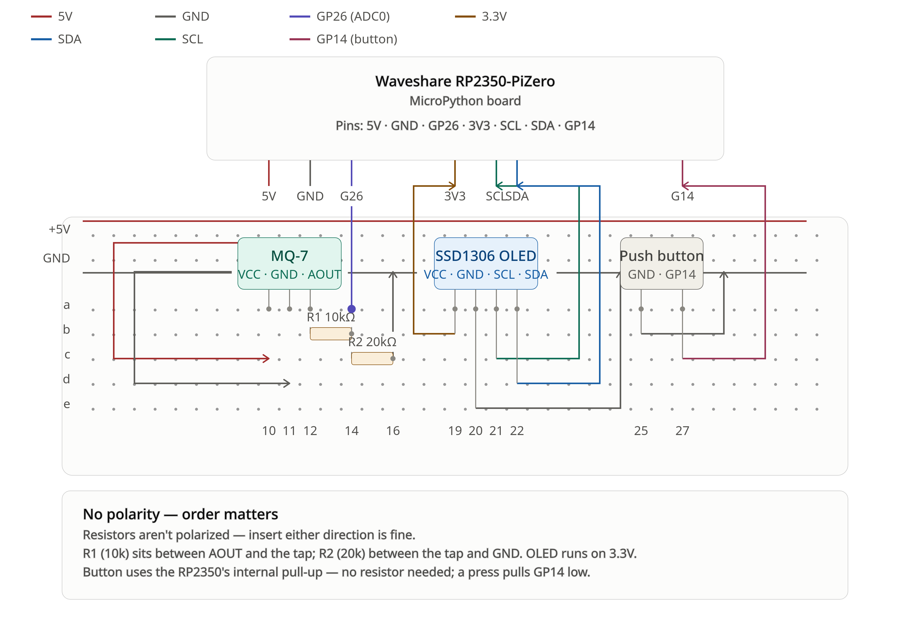

# Garage Exhaust Monitor (PoC)

[](https://micropython.org/)
[](https://www.raspberrypi.com/products/raspberry-pi-pico-2/)
[-orange.svg)]()
[]()

A standalone proof-of-concept (PoC) carbon monoxide (CO) exhaust monitor designed for enclosed garages and indoor vehicle areas. Running on the **Raspberry Pi Pico 2 (RP2350)** with **MicroPython**, the system continuously monitors CO concentration levels, computes real-time occupational air quality metrics (PPM and $\text{mg/m}^3$), renders live data on a 0.96" SSD1306 OLED display, and provides instant min/max statistics reset via a tactile push button.



---

## Features

- **Real-Time CO Sensing:** Reads analog voltage from an MQ-7 carbon monoxide sensor via ADC.
- **Air Quality Metric Conversion:** Translates analog ADC voltages into real-world units:
  - **PPM (parts per million)** using the MQ-7 power-law curve: $\text{PPM} = 98.322 \times \left(\frac{R_s}{R_0}\right)^{-1.458}$
  - **Mass Concentration ($\text{mg/m}^3$)**: $\text{mg/m}^3 = \text{PPM} \times 1.146$ (standard at 25°C, 1 atm).
- **Statistical Peak & Baseline Tracking:** Tracks Current, Minimum, and Maximum (peak) PPM concentrations over time.
- **Physical UI & Debounced Reset:** Tactile push-button with non-blocking debounce logic (`time.ticks_ms()`) to reset Min/Max statistics on demand.
- **8-Row OLED Dashboard:** Formatted 128x64 display output with dedicated metric lines and status alerts.
- **Robust Diagnostic Boot Sequence:** Visual step-by-step diagnostic check of OLED, button, and sensor on startup.
- **Non-Blocking Architecture:** High-responsiveness cooperative loop with 1 Hz sensor sampling and 4 Hz (250 ms) display refresh rates.

---

## Hardware Requirements

| Component | Model / Spec | Description |
| :--- | :--- | :--- |
| **Microcontroller** | Raspberry Pi Pico 2 (RP2350) | Dual-core ARM Cortex-M33 / Hazard3 RISC-V |
| **Gas Sensor** | MQ-7 Carbon Monoxide Sensor | Detects CO concentrations (20–2000 PPM) |
| **Display** | 0.96" SSD1306 OLED (128x64) | Monochrome I2C display |
| **Resistors** | 2x 10kΩ resistors (or 10kΩ + 20kΩ) | Voltage divider to step 5V sensor output down to 3.3V ADC-safe range |
| **Input Button** | Tactile momentary push button | Statistics reset input |
| **Power Supply** | 5V DC power source / USB | 5V rail for MQ-7 heater and RP2350 VBUS |

> **Note on MQ-7 Preheating:** The MQ-7 gas sensor requires an initial warm-up period (typically 3–5 minutes) to stabilize its internal heating coil before measurements are accurate.

---

## Pinout & Wiring

### 1. MQ-7 Gas Sensor (Analog ADC)
The MQ-7 runs on a 5V supply and outputs 0–5V analog signal. To protect the RP2350 3.3V ADC, the analog output passes through a 10kΩ/10kΩ voltage divider (voltage divider ratio of 2.0, max 2.5V output).

- **VCC:** Connect to 5V supply (`VBUS` / Pin 40)
- **GND:** Connect to Ground (`GND` / Pin 38)
- **AOUT (Analog Out):** Connected to voltage divider:
  - Resistor $R_1$ (10kΩ) between MQ-7 `AOUT` and RP2350 `GP26`
  - Resistor $R_2$ (10kΩ) between RP2350 `GP26` and `GND`
- **RP2350 Pin:** `GP26` (Pin 31, ADC0)

### 2. SSD1306 OLED Display (I2C)
Powered from the 3.3V logic rail (`3V3(OUT)` / Pin 36) using I2C bus 1 at 400 kHz:

| OLED Pin | Pico 2 Pin | Physical Pin # | Description |
| :--- | :--- | :--- | :--- |
| **VCC** | `3V3(OUT)` | Pin 36 | 3.3V Power |
| **GND** | `GND` | Pin 38 | Ground |
| **SDA** | `GP2` | Pin 4 | I2C1 Data |
| **SCL** | `GP3` | Pin 5 | I2C1 Clock |

### 3. Tactile Push Button
- One terminal to `GP14` (Pin 19)
- Opposite terminal to `GND` (Pin 18 or 23)
- Utilizes the RP2350 internal pull-up resistor (active LOW: pressed = 0, released = 1).

---

## OLED Display Layout

The 128x64 display uses the standard 8x8 font rendering 8 rows of up to 16 characters each:

```text
+----------------+
| SENSOR MONITOR |  <- Line 0: Application title
| [MONITORING]   |  <- Line 1: State / [STATS RESET] / Alerts
| MQ-7 CO Sensor |  <- Line 2: Sensor identification
| Cur:  12.4 PPM |  <- Line 3: Current CO concentration
| Min:   2.1 PPM |  <- Line 4: Minimum recorded PPM
| Max:  38.7 PPM |  <- Line 5: Maximum recorded PPM
| Mass: 14.2 mg/m3| <- Line 6: Mass concentration
| Press to reset |  <- Line 7: Button interaction hint
+----------------+
```

---

## Software Architecture

The project employs a flat, modular structure optimized for MicroPython memory consumption:

```text
pi-sensors-mq/
├── firmware/         # Firmware binaries or deployment helpers
├── openspec/         # OpenSpec formal specifications, proposals, and design deltas
├── src/
│   ├── config.py     # Hardware pin assignments, ADC calibrations, and timing intervals
│   ├── button.py     # DebouncedButton class with software debounce
│   ├── sensors.py    # GasSensor and SensorManager (PPM and mg/m3 conversions)
│   ├── display.py    # OLEDView class handling 8-row SSD1306 rendering
│   ├── lib/
│   │   └── ssd1306.py# Standard MicroPython SSD1306 framebuf driver
│   └── main.py       # GarageMonitorApp: boot diagnostics & non-blocking main loop
├── tests/            # Python unit test suite for host execution
│   ├── test_hardware_abstractions.py
│   └── test_application.py
└── README.md
```

### Key Modules

- **[`src/config.py`](file:///home/fuchik0ma/code/pi-sensors-mq/src/config.py):** Central configuration for pins (`PIN_MQ7_ADC`, `PIN_I2C_SDA`, `PIN_I2C_SCL`, `PIN_BUTTON`), sampling intervals (1000 ms sample, 250 ms display), and empirical MQ-7 curve coefficients.
- **[`src/sensors.py`](file:///home/fuchik0ma/code/pi-sensors-mq/src/sensors.py):** Hardware abstraction for the gas sensor, calculating sensor resistance $R_s$, PPM concentration via power-law curve, and maintaining running min/max statistics.
- **[`src/button.py`](file:///home/fuchik0ma/code/pi-sensors-mq/src/button.py):** Non-blocking push button debouncer using `time.ticks_ms()` to eliminate mechanical contact bounce.
- **[`src/display.py`](file:///home/fuchik0ma/code/pi-sensors-mq/src/display.py):** Manages OLED frame buffer drawing and metric formatting.
- **[`src/main.py`](file:///home/fuchik0ma/code/pi-sensors-mq/src/main.py):** Application orchestrator that runs boot diagnostics, enters the cooperative polling loop, and listens for button reset events.

---

## Getting Started

### 1. Flash MicroPython onto the Pico 2
Download the official MicroPython firmware for Raspberry Pi Pico 2 (`.uf2` file) from [micropython.org](https://micropython.org/download/RPI_PICO2/). Hold the `BOOTSEL` button on the Pico 2 while plugging it into your computer, and drag the `.uf2` file onto the mass storage drive.

### 2. Deploy Code to the Pico 2
Transfer the contents of `src/` to the root filesystem of the Pico 2 using [mpremote](https://docs.micropython.org/en/latest/reference/mpremote.html), [rshell](https://github.com/dhylands/rshell), or [Thonny IDE](https://thonny.org/):

Using `mpremote`:
```bash
# Install mpremote
pip install mpremote

# Copy library and source files
mpremote fs mkdir lib
mpremote fs cp src/lib/ssd1306.py :lib/ssd1306.py
mpremote fs cp src/config.py :config.py
mpremote fs cp src/button.py :button.py
mpremote fs cp src/sensors.py :sensors.py
mpremote fs cp src/display.py :display.py
mpremote fs cp src/main.py :main.py

# Run the application
mpremote run src/main.py
```

### 3. Running Host Unit Tests
The codebase includes compatibility shims allowing unit tests to run on a host machine using Python's standard `unittest` framework:

```bash
python3 -m unittest discover tests
```

---

## Specifications & Design

Formal specifications, architectural decisions, and tasks for this project are tracked using [OpenSpec](openspec/) in `openspec/changes/add-garage-exhaust-monitor-poc/`:
- [`proposal.md`](file:///home/fuchik0ma/code/pi-sensors-mq/openspec/changes/add-garage-exhaust-monitor-poc/proposal.md): Motivation, scope, and capabilities.
- [`design.md`](file:///home/fuchik0ma/code/pi-sensors-mq/openspec/changes/add-garage-exhaust-monitor-poc/design.md): Architectural decisions (voltage dividers, power law conversion, OLED layout, non-blocking time loop).
- [`spec.md`](file:///home/fuchik0ma/code/pi-sensors-mq/openspec/changes/add-garage-exhaust-monitor-poc/specs/garage-monitor/spec.md): Requirements and behavioral test scenarios.
- [`tasks.md`](file:///home/fuchik0ma/code/pi-sensors-mq/openspec/changes/add-garage-exhaust-monitor-poc/tasks.md): Implementation checklist.
